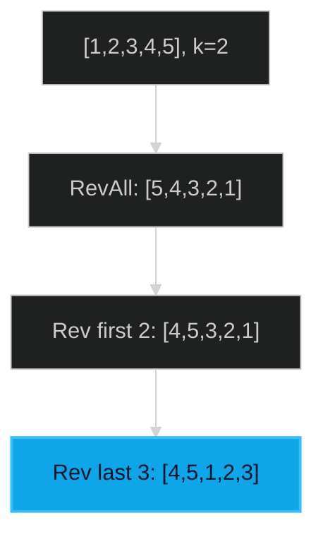

# Rotate Array 🟡 Medium

**Tags**: `Array`, `Two Pointers`

## Prerequisite Topics

| Topic | Difficulty | Relevance | Notes |
|-------|-----------|-----------|-------|
| Array Manipulation | 🟢 Easy | **Critical** | In-place modifications |

## The Challenge

Given an integer array `nums`, rotate the array to the right by `k` steps, where `k` is non-negative.

**Constraints**:
- $1 \leq nums.length \leq 10^5$
- $0 \leq k \leq 10^5$

**Example**:
```python
Input: nums = [1,2,3,4,5,6,7], k = 3
Output: [5,6,7,1,2,3,4]
```

## Algorithmic Analysis

### Optimal Approach (Reversal Trick)
1. Reverse the entire array.
2. Reverse the first `k` elements.
3. Reverse the remaining `n-k` elements.
- **Why**: Reversing twice restores order for sub-segments while shifting their positions.

## Complexity Analysis

| Dimension | Complexity | Justification |
|-----------|-----------|---------------|
| Time | $O(N)$ | Three passes over the array. |
| Space | $O(1)$ | In-place rotation. |

## Visual Walkthrough



## Solution

```python
def rotate_array(self, nums: list[int], k: int) -> None:
    n = len(nums)
    k %= n
    def reverse(left, right):
        while left < right:
            nums[left], nums[right] = nums[right], nums[left]
            left, right = left + 1, right - 1
    reverse(0, n - 1)
    reverse(0, k - 1)
    reverse(k, n - 1)
```
