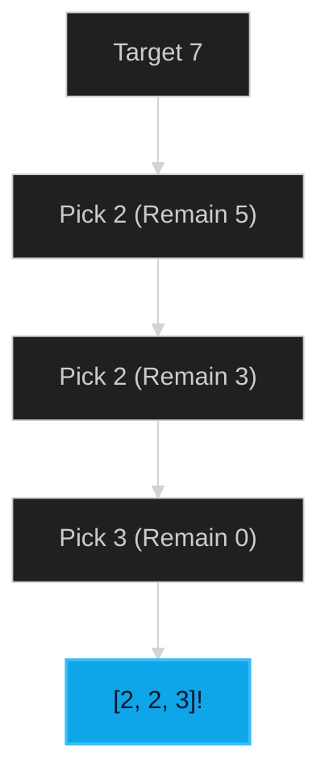

# Combination Sum 🟡 Medium

**Tags**: `Array`, `Backtracking`

## Prerequisite Topics

| Topic | Difficulty | Relevance | Notes |
|-------|-----------|-----------|-------|
| Recursion | 🟡 Medium | **Critical** | Exploring combinations |

## The Challenge

Given an array of **distinct** integers `candidates` and a `target` integer, return a list of all unique combinations where the chosen numbers sum to `target`. You may use the same number an unlimited number of times.

**Constraints**:
- $1 \leq candidates.length \leq 30$
- $1 \leq candidates[i] \leq 200$
- $1 \leq target \leq 500$

## Algorithmic Analysis

### Optimal Approach (Backtracking)
Sort candidates to allow pruning.
- **Logic**: In the recursion, maintain a `remain` target. For each choice, subtract it and recurse. To avoid duplicates, start the next search from the current index.

## Complexity Analysis

| Dimension | Complexity | Justification |
|-----------|-----------|---------------|
| Time | $O(2^T)$ | $T$ is target; roughly exponential. |
| Space | $O(T/min)$ | Recursion depth. |

## Visual Walkthrough



## Solution

```python
def combination_sum(self, candidates: list[int], target: int) -> list[list[int]]:
    results = []
    def backtrack(remain, curr, start):
        if remain == 0:
            results.append(list(curr))
            return
        for i in range(start, len(candidates)):
            if candidates[i] <= remain:
                curr.append(candidates[i])
                backtrack(remain - candidates[i], curr, i)
                curr.pop()
    candidates.sort()
    backtrack(target, [], 0)
    return results
```
