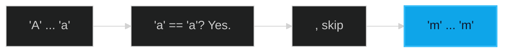

# Valid Palindrome 🟢 Easy

**Tags**: `Two Pointers`, `String`

## Prerequisite Topics

| Topic | Difficulty | Relevance | Notes |
|-------|-----------|-----------|-------|
| Two Pointers | 🟢 Easy | **Critical** | Comparing from boundaries |

## The Challenge

Given a string `s`, return `true` if it is a palindrome, or `false` otherwise, after converting all uppercase letters into lowercase letters and removing all non-alphanumeric characters.

**Constraints**:
- $1 \leq s.length \leq 2 \cdot 10^5$

**Example**:
```python
Input: s = "A man, a plan, a canal: Panama"
Output: True
```

## Algorithmic Analysis

### Optimal Approach (Two Pointers)
Initialize pointers at `0` and `len(s)-1`.
- **Logic**: Skip non-alphanumeric characters. Compare the characters at both pointers (case-insensitive). Move pointers inward.

## Complexity Analysis

| Dimension | Complexity | Justification |
|-----------|-----------|---------------|
| Time | $O(N)$ | Single pass. |
| Space | $O(1)$ | No extra space used. |

## Visual Walkthrough



## Solution

```python
def is_valid_palindrome(self, s: str) -> bool:
    left, right = 0, len(s) - 1
    while left < right:
        while left < right and not s[left].isalnum(): left += 1
        while left < right and not s[right].isalnum(): right -= 1
        if s[left].lower() != s[right].lower(): return False
        left += 1; right -= 1
    return True
```
