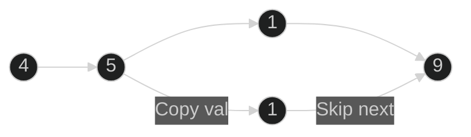

# Delete Node in a Linked List 🟡 Medium

**Tags**: `Linked List`

## Prerequisite Topics

| Topic | Difficulty | Relevance | Notes |
|-------|-----------|-----------|-------|
| Node Pointers | 🟢 Easy | **Critical** | Basic list manipulation |

## The Challenge

Delete a node from a singly linked list. You are given only access to the node to be deleted (not the head).

**Constraints**:
- The node to be deleted is in the list and is not a tail node.

## Algorithmic Analysis

### Optimal Approach (Value Shifting)
Since we can't delete the node normally (we don't have the previous node), we copy the data from the next node into the current node, then "delete" the next node.

## Complexity Analysis

| Dimension | Complexity | Justification |
|-----------|-----------|---------------|
| Time | $O(1)$ | Single operation. |
| Space | $O(1)$ | No extra space. |

## Visual Walkthrough



## Solution

```python
def delete_node(self, node: ListNode) -> None:
    # Copy next node's value and skip it
    node.val = node.next.val
    node.next = node.next.next
```
