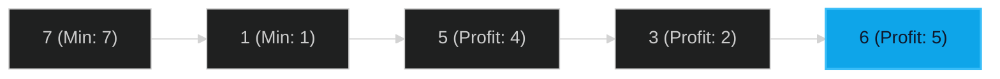

# Best Time to Buy and Sell Stock 🟢 Easy

**Tags**: `Array`, `Dynamic Programming`

## Prerequisite Topics

| Topic | Difficulty | Relevance | Notes |
|-------|-----------|-----------|-------|
| Greedy | 🟢 Easy | **Critical** | Keeping track of min price |

## The Challenge

You are given an array `prices` where `prices[i]` is the price of a given stock on the `i`-th day. You want to maximize your profit by choosing a **single day** to buy one stock and choosing a **different day in the future** to sell that stock.

**Constraints**:
- $1 \leq prices.length \leq 10^5$

**Example**:
```python
Input: [7,1,5,3,6,4]
Output: 5
Explanation: Buy on day 2 (price 1) and sell on day 5 (price 6).
```

## Algorithmic Analysis

### Optimal Approach (One Pass)
Initialize `min_price` to infinity and `max_profit` to 0.
- **Logic**: For each price, if it's lower than `min_price`, update `min_price`. Otherwise, calculate the potential profit (`price - min_price`) and update `max_profit` if it's higher.

## Complexity Analysis

| Dimension | Complexity | Justification |
|-----------|-----------|---------------|
| Time | $O(N)$ | Single pass through the array. |
| Space | $O(1)$ | Constant extra space. |

## Visual Walkthrough



## Solution

```python
def max_profit(self, prices: list[int]) -> int:
    min_price = float("inf")
    max_profit = 0
    for price in prices:
        if price < min_price:
            min_price = price
        elif price - min_price > max_profit:
            max_profit = price - min_price
    return max_profit
```
