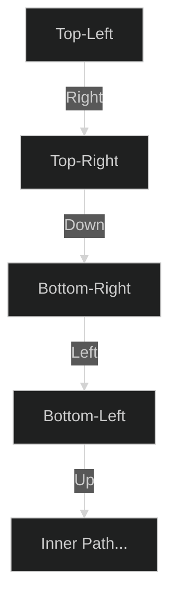

# Spiral Matrix 🟡 Medium

**Tags**: `Array`, `Matrix`, `Simulation`

## Prerequisite Topics

| Topic | Difficulty | Relevance | Notes |
|-------|-----------|-----------|-------|
| Matrix Traversal | 🟢 Easy | **Critical** | Managing 4 boundaries |

## The Challenge

Given an `m x n` matrix, return all elements of the matrix in spiral order.

**Constraints**:
- $m, n \leq 10$

**Example**:
```python
Input: matrix = [[1,2,3],[4,5,6],[7,8,9]]
Output: [1,2,3,6,9,8,7,4,5]
```

## Algorithmic Analysis

### Optimal Approach (Simulation with Boundaries)
Maintain 4 boundaries: `top`, `bottom`, `left`, `right`.
- **Logic**: Traverse Right along `top`, then increment `top`. Traverse Down along `right`, then decrement `right`. Traverse Left along `bottom`, then decrement `bottom`. Traverse Up along `left`, then increment `left`.
- **Condition**: Continue as long as `len(result) < rows * cols`.

## Complexity Analysis

| Dimension | Complexity | Justification |
|-----------|-----------|---------------|
| Time | $O(N \cdot M)$ | Visit each cell once. |
| Space | $O(1)$ | No extra space beyond result. |

## Visual Walkthrough



## Solution

```python
def spiral_order(self, matrix: list[list[int]]) -> list[int]:
    if not matrix: return []
    res = []
    rows, cols = len(matrix), len(matrix[0])
    top, bottom, left, right = 0, rows-1, 0, cols-1
    while len(res) < rows * cols:
        for i in range(left, right + 1): res.append(matrix[top][i])
        top += 1
        if top > bottom: break
        for i in range(top, bottom + 1): res.append(matrix[i][right])
        right -= 1
        if left > right: break
        for i in range(right, left - 1, -1): res.append(matrix[bottom][i])
        bottom -= 1
        if top > bottom: break
        for i in range(bottom, top - 1, -1): res.append(matrix[i][left])
        left += 1
    return res
```
