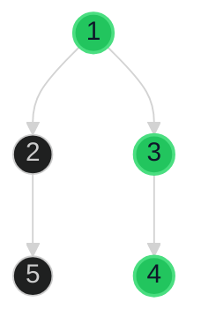

# Binary Tree Right Side View 🟡 Medium

**Tags**: `Tree`, `BFS`, `DFS`

## Prerequisite Topics

| Topic | Difficulty | Relevance | Notes |
|-------|-----------|-----------|-------|
| Level Order Traversal | 🟡 Medium | **Critical** | Identifying last node per level |

## The Challenge

Given the `root` of a binary tree, imagine yourself standing on the **right side** of it, return the values of the nodes you can see ordered from top to bottom.

**Example**:
```python
Input: root = [1,2,3,null,5,null,4]
Output: [1,3,4]
```

## Algorithmic Analysis

### Optimal Approach (BFS / Level Order)
Perform a level-order traversal (using a queue).
- **Key Insight**: For each level, the last node processed in the queue is the one visible from the right side.
- **Process**: At each level, note the size, iterate through nodes, and only add the last node's value to the result list.

## Complexity Analysis

| Dimension | Complexity | Justification |
|-----------|-----------|---------------|
| Time | $O(N)$ | Visit each node once. |
| Space | $O(W)$ | $W$ is the max width of the tree. |

## Visual Walkthrough



## Solution

```python
def right_side_view(self, root: TreeNode | None) -> list[int]:
    if not root: return []
    result = []
    queue = deque([root])
    while queue:
        level_size = len(queue)
        for i in range(level_size):
            node = queue.popleft()
            if i == level_size - 1: result.append(node.val)
            if node.left: queue.append(node.left)
            if node.right: queue.append(node.right)
    return result
```
